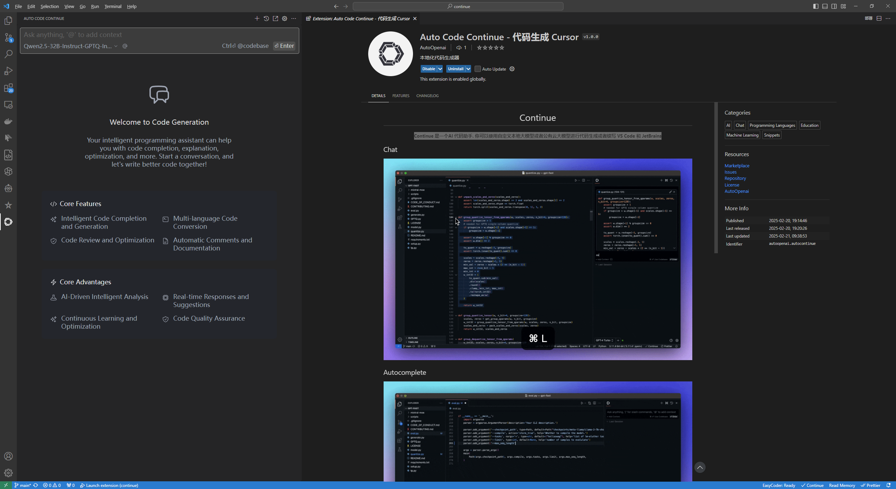
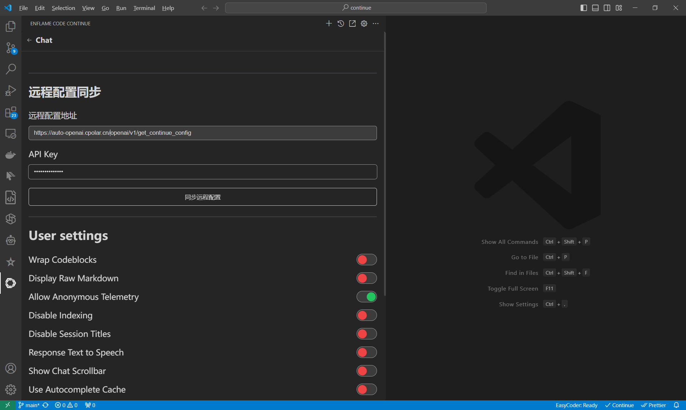

<h1 align="center">Auto Code Continue</h1>

**[Auto Code Continue](https://auto-openai.cpolar.cn/) 是领先的开源 AI 代码助手。您可以连接任何模型和上下文，在 VS Code中构建自定义的代码自动补全和对话体验**

## Home

## Auto Openai 本地大模型

## Auto Openai 一键配置

## Chat

[Chat](https://continue.dev/docs/chat/how-to-use-it) makes it easy to ask for help from an LLM without needing to leave the IDE

## Autocomplete

[Autocomplete](https://continue.dev/docs/autocomplete/how-to-use-it) provides inline code suggestions as you type

## Edit

[Edit](https://continue.dev/docs/edit/how-to-use-it) is a convenient way to modify code without leaving your current file

## Actions

[Actions](https://continue.dev/docs/actions/how-to-use-it) are shortcuts for common use cases.

## License

[Apache 2.0 © 2023-2024 ](./LICENSE)
